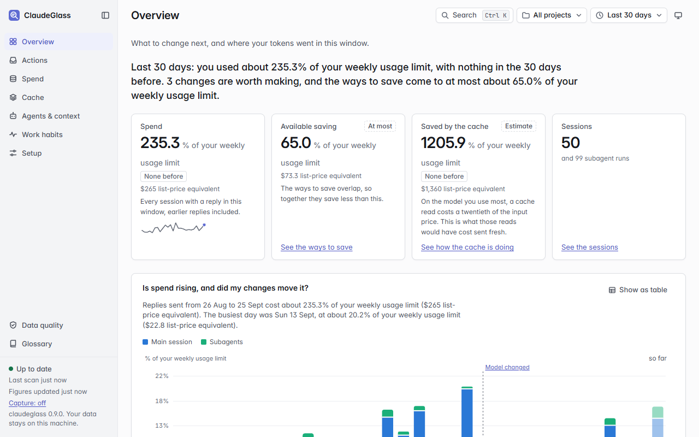
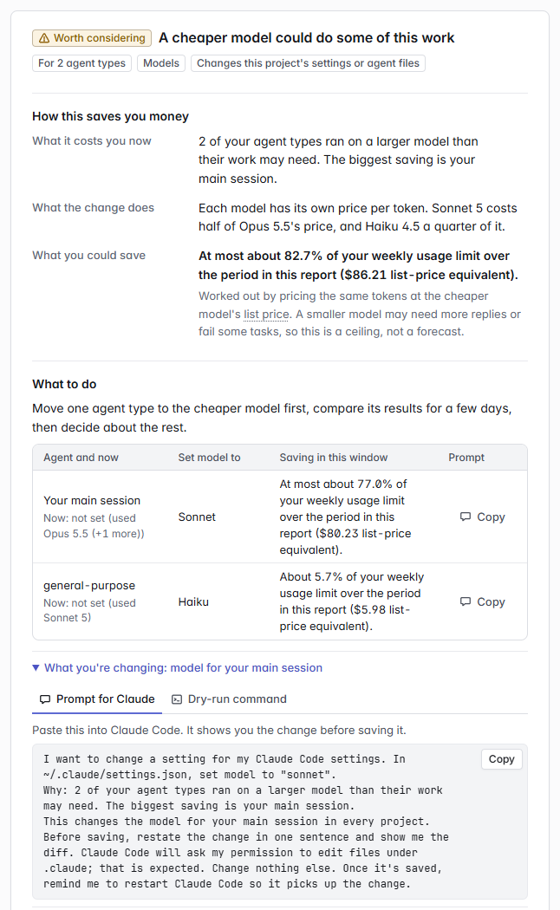

# claude-token-lens

See where your Claude Code tokens go, and what to change to spend less,
from the transcripts already on your machine.

No telemetry, no runtime dependencies, and a dashboard that runs only on
your own computer.

[](https://github.com/PaulMorrisDev/claude-token-lens/releases/latest)
[](https://github.com/PaulMorrisDev/claude-token-lens/actions/workflows/ci.yml)
[](pyproject.toml)
[](LICENSE)

<picture>
  <source media="(prefers-color-scheme: dark)" srcset="docs/images/overview-dark.png">
  <source media="(prefers-color-scheme: light)" srcset="docs/images/overview-light.png">
  
</picture>

<sub><i>The Overview page. Synthetic data, 30-day window, subscription billing.</i></sub>

[Quick start](#quick-start) · [What each page answers](#what-each-page-answers) · [Privacy](#privacy) · [Documentation](#documentation)

## Why use it

- **See where your tokens went.** Every session, subagent and cache
  rebuild is priced, and you can split them by project, model and day.
- **Know what to change next.** Each recommendation names the setting,
  the file, the expected effect and what you give up.
- **One check per way of saving.** Models, effort, conversation
  summaries, cache, tools, skills, CLAUDE.md, tool output and habits,
  each answered from your own sessions.
- **See whether a change worked.** It records your settings as each
  session starts, and compares the sessions before a change with those
  after it.
- **Amounts in your billing mode.** On a Pro or Max plan they're a share
  of your usage limits. On pay-per-token billing they're dollars.
- **Nothing changes by itself.** Every change is a prompt you give Claude
  or a command you run, and you can preview the command with `--dry-run`.

## Quick start

About five minutes. You need Claude Code, already used for a while so
there are sessions to look at, and Python 3.11 or newer. The commands
below are for **Windows PowerShell**. On macOS or Linux, type them in
Terminal with `python3` in place of `python`.

> [!NOTE]
> Every command here starts `python -m claude_token_lens`. The shorter
> `claude-token-lens` works only when pip's Scripts folder is on your
> `PATH`, which on Windows it often isn't. pip prints a yellow WARNING
> when it isn't.

### Where to install it

Anywhere. You don't install it into a repository, and it doesn't matter
which folder your terminal is in. Claude Code keeps a transcript of
every session, for every repository, in one folder:
`%USERPROFILE%\.claude\projects` on Windows, `~/.claude/projects`
elsewhere. claude-token-lens reads that folder, so the dashboard shows
all your repositories at once.

Only two commands care where you run them. `init` names the repository
you're in as "this project". `report` and `check` look at only that
repository unless you add `--all-projects`. Also run Claude Code inside
WSL? Still install it on Windows; see
[Using Claude Code in WSL too](#using-claude-code-in-wsl-too).

### 1. Check Python

Open PowerShell and run:

```powershell
python --version
```

It should print `Python 3.11` or higher. If it says `python` isn't
recognized, or shows an older version, install Python from
[python.org](https://www.python.org/downloads/). Tick **Add python.exe
to PATH** in the installer, then open a new PowerShell window.

### 2. Install

```powershell
python -m pip install git+https://github.com/PaulMorrisDev/claude-token-lens
python -m claude_token_lens --version
```

The second line should print `claude-token-lens 0.8.0` or later.

No git on this machine, or no pip at all? See
[Other ways to install](#other-ways-to-install) below.

### 3. Set up

```powershell
python -m claude_token_lens init
```

It asks up to four questions:

1. **How you pay for Claude Code.** `1` for a Pro, Max, Team or
   Enterprise plan, `2` for an API key. Amounts then show as a share of
   your usage limits, or in dollars.
2. **Connect to Claude Code.** It adds a small hook to your Claude Code
   `settings.json` that records which settings each session ran with.
   The dashboard uses it to show what changed and what that did. It
   adds no tokens.
3. **Start the dashboard when you log on.** Say yes. It starts straight
   away, and again every time you log on.
4. **Sharper tips**, optional. Claude ends each reply with a short tag,
   such as `[tl: task=bugfix brief=clear]`, so the tips fit how you
   work. It costs a few hundred tokens a session and switches itself
   off after 14 days.

Then it lists every change and asks once: **Go ahead? [Y/n/d]**. Type
`d` to see the exact `settings.json` change first, or `n` to change
nothing. It backs `settings.json` up before changing it. It ends with a
checklist of what's set up and what to open next; run
`python -m claude_token_lens status` to see it again any time.

It finds your WSL sessions itself, if you have any, and includes them.
`init --advanced` also asks about the rest: projects to leave out, the
time zone, and the full metrics capture choices.

> [!WARNING]
> Claude Code deletes old transcripts, after 30 days by default. The
> dashboard keeps the figures for every session it has read, so keep it
> running and it reads each session before the transcript goes.

### 4. Open the dashboard

Go to **http://127.0.0.1:8765** in your browser. On the first start, a
banner shows its progress while it reads your history. That takes
seconds to a few minutes, and figures fill in as it goes.

Start with **Next best actions** on the Overview page. Then open
**Actions › Checks**, which answers one question per way of saving, such
as "Is each agent on the cheapest model that does the job?". The bottom
of the sidebar shows the version that is running.

It only runs on your machine; nobody else can open it.

### Only want a quick look?

You can skip `init` and the dashboard:

```powershell
python -m claude_token_lens check --all-projects
python -m claude_token_lens report --all-projects
```

`check` answers the quick-action questions, and `report` prints the full
analysis. Both print to the terminal and change nothing.

### Other ways to install

<details>
<summary>No git, no pip, a local copy, or pipx</summary>

| Route | Command | Needs |
|---|---|---|
| From GitHub | `python -m pip install git+https://github.com/PaulMorrisDev/claude-token-lens` | pip, git and network |
| From GitHub, without git | `python -m pip install https://github.com/PaulMorrisDev/claude-token-lens/archive/refs/heads/main.zip` | pip and network |
| From a local copy | `python -m pip install <folder>`, or `pipx install <folder>` to keep it apart from other Python tools | pip |
| Single file | Download [`claude-token-lens.pyz`](https://github.com/PaulMorrisDev/claude-token-lens/releases/latest/download/claude-token-lens.pyz) from the latest release, then run `python claude-token-lens.pyz` wherever this page says `python -m claude_token_lens` | Python only |

The package has no runtime Python dependencies. `rich` is an optional
extra for nicer terminal output. The dashboard's d3 and fonts ship
inside the package, pinned by sha256.

[`docs/first-run.md`](docs/first-run.md) walks through each route on a
locked-down work machine. Building the `.pyz` yourself is covered in
[`docs/deploy.md`](docs/deploy.md#distribution-without-pip-the-pyz-build).

</details>

## Using Claude Code in WSL too

If you also run Claude Code inside WSL (Ubuntu on Windows), its sessions
are kept inside Linux, in
`\\wsl.localhost\<distro>\home\<you>\.claude\projects`. Install
claude-token-lens on **Windows** as above, not inside WSL, and run
`python -m claude_token_lens init`. It finds those folders itself and
includes them, naming each distro when it starts. The dashboard then
shows your Windows and WSL sessions together. A **Where** column on
**Spend › Sessions** says which is which ("This computer" or
"WSL: Ubuntu").

- It only reads those folders, the same as your Windows one. It changes
  nothing inside WSL.
- While the dashboard runs, it looks in them every 30 seconds, which
  keeps WSL running in the background. If WSL is shut down, the
  dashboard carries on with what it already has. It picks up the rest
  when WSL is back.
- The "Connect to Claude Code" hook is for Claude Code on Windows. The
  copy of Claude Code inside WSL has its own settings and doesn't need
  it.
- Added a WSL distro later? Run `init` again. To list the folders by
  hand, put them in `config.toml` (in `%USERPROFILE%\.claude\token-lens`)
  and restart the dashboard with
  `python -m claude_token_lens install-service`:

  ```toml
  extra_projects_roots = ['\\wsl.localhost\Ubuntu\home\alice\.claude\projects']
  ```

  A one-off command can take several folders too:
  `python -m claude_token_lens report --all-projects --projects-root <folder> --projects-root <another>`.

## What each page answers

The sidebar lists seven pages, with Data quality and the Glossary at its
foot. A page with more than one part shows its segments beside its
title.

| Page | The question it answers |
|---|---|
| Overview | What should I change next, and where did my tokens go? |
| Actions › Recommendations | What exactly should I change, where, and what is the trade-off? |
| Actions › Checks | For each way of saving (models, effort, summaries, cache, tools, skills, CLAUDE.md, tool output, hooks, habits), and whether any agent is struggling: is there anything to do, and what exactly? |
| Spend › Usage | How is my usage spread over days, models, projects and five-hour blocks? |
| Spend › Savings | What would shorter tool output, earlier summaries, cheaper models or fewer wasted replies save? |
| Spend › Sessions | Which sessions cost the most? Pick one to see why it was expensive. |
| Cache › Rebuilds | When did Claude Code rebuild the prompt cache, and what caused it? |
| Cache › Lifetime (TTL) | Would a 1-hour cache lifetime have paid for itself? |
| Agents & context › Subagents | What do my subagents cost, what are they given when they start, what do they send back, and would splitting long runs save? |
| Agents & context › Quality | Is my subagents' work going well (failed tool calls, runs that don't finish, runs a larger model had to redo, per model and effort), and how do I split the work? |
| Agents & context › Context | What does each CLAUDE.md file and skill cost, who is it sent to, and what can be trimmed, moved or hidden? |
| Agents & context › Hooks | Does each hook I set up work, and what do its failures, blocked calls and added context cost? |
| Work habits | What habits are costing tokens, where did the evidence come from, and what would `/tl-feedback` and brief templates add? |
| Setup › Settings | What are my settings, and did changing them change my costs? |
| Setup › Profiles | Make a profile from a goal with an estimate of what it saves, compare it with my settings, and see what each change I made did. |
| Setup › Capture | What does metrics capture cost so far, what would each level or metric add, and is it set up? |
| Data quality | What did this tool install, what should I expect, and could every transcript be read and priced? |
| Glossary › Terms | What does a term on the dashboard mean? |
| Glossary › How costs work | How is each kind of token priced, and how does each change save me money? |

The window picker at the top right sets the time every page covers. Pick
the last hour, today or the last 24 hours to see the effect of a change
straight away. Pick 7 to 90 days or all time for the long view, or
**since my last change**. The project picker beside it narrows every
page to one project. The theme button switches between your system's
theme, light and dark. **Setup › Capture** and **Glossary › Terms**
don't depend on the window, and say so.

Every view has its own address, such as `#/spend/usage?w=30`, so Back,
Forward, bookmarks and shared links work, with the window and project
kept. **Search** (Ctrl+K) finds pages, tables, recommendations, checks,
glossary terms, recent sessions and projects. It also runs commands,
such as setting the window or copying a prompt. Press `?` for the
keyboard shortcuts.

Every figure a recommendation rests on links to the table row it came
from. A table that feeds a recommendation says so ("Feeds 2 actions").
**Show as table** on any chart gives the same figures as a grid.

Amounts follow your billing mode. On a Pro or Max plan, amounts are a
share of your usage limits once the status line has logged enough
usage-limit readings. Until then they're list-price equivalents: what
the tokens would cost at Anthropic's published prices. On pay-per-token
billing, amounts are what you pay.

## Acting on a recommendation

<picture>
  <source media="(prefers-color-scheme: dark)" srcset="docs/images/recommendation-dark.png">
  <source media="(prefers-color-scheme: light)" srcset="docs/images/recommendation-light.png">
  
</picture>

<sub><i>A recommendation on the Actions page. Synthetic data.</i></sub>

Each recommendation card explains the change before offering it. It
says what the setting controls, its value now and after, which file it's
written to and who that affects. Then it gives the expected effect, the
trade-off, and how to undo it. There are two ways to make the change:

- **Ask Claude to do it.** Copy the prompt into Claude Code. It names the
  file, the setting and the value, and says why. It asks Claude to
  restate the change and show you the diff before saving. Claude Code
  asks your permission before editing files under `.claude`; that's
  expected.
- **Or run the command.** For a plain setting, the card shows a command
  such as:

  ```powershell
  python -m claude_token_lens apply --set effortLevel=medium --scope user --dry-run
  ```

  `--dry-run` explains the change and prints the diff without writing
  anything. Run it again without `--dry-run` to make the change. The
  file is backed up first, and the output ends with the
  `apply --revert <TS>` command that undoes it. A revert won't run if
  the file was edited after the change, so it can't throw away your
  later edits. Add `--ignore-changes` to revert anyway.

The dashboard never changes a setting itself; there's no Apply button.
Its commands use the form that runs on your machine.

Then restart Claude Code. It reads some settings, such as the model and
effort level, only when a session starts, so a restart is the way to be
sure. `claude --continue` picks your last conversation back up. Every
card, `apply` and `apply --revert` remind you, and each prompt asks
Claude to remind you once it has saved.

Profiles on **Setup › Profiles** work the same way for several settings
at once. Each gives you a prompt, an `apply <profile> --dry-run`
command, or a one-session trial (`apply <profile> --launch`) that leaves
your settings files alone. See
[`docs/profiles.md`](docs/profiles.md#applying-a-profile).

## Updating

```powershell
python -m claude_token_lens update
```

That one command:

- installs the newest version for this Python;
- restarts the dashboard on it, and checks that the dashboard answering
  on port 8765 is the new one. On Windows, if an older copy started by
  hand still holds the port, it names it and offers to stop it;
- brings the hook and status line entries this tool added to Claude
  Code's `settings.json` up to date. It shows each change and asks
  first, and backs up `settings.json` before any change;
- finds copies installed for other Pythons, and offers to remove the
  ones nothing uses any more.

Add `--dry-run` to see what it would do, or `--yes` to answer yes to
every question. On macOS, restart the dashboard afterwards with
`launchctl kickstart -k gui/$(id -u)/com.claude-token-lens`.

**Updating from 0.6.0 or older**, `update` installs the new version but
not the steps after it. Run them once, and from then on `update` alone
does everything:

```powershell
python -m claude_token_lens update
python -m claude_token_lens update --finish
```

**On version 0.4 or older** (`update` says it's an invalid choice),
install by hand once, then finish:

```powershell
python -m pip install --upgrade --force-reinstall git+https://github.com/PaulMorrisDev/claude-token-lens
python -m claude_token_lens update --finish
```

`update` is the one command that goes online: pip downloads the new
version from GitHub. Check that the foot of the dashboard's sidebar
shows the new version. After an update the dashboard may read your
history again once, so the first page load can be slow.
[`CHANGELOG.md`](CHANGELOG.md) lists what changed.

## Uninstalling

Look at what would be removed first:

```powershell
python -m claude_token_lens uninstall --revert-changes --delete-data --dry-run
```

Then run the same command without `--dry-run`. It removes the hook and
the logon service, undoes any setting changes you made through this
tool, and deletes its data, asking before each step. Finally:

```powershell
python -m pip uninstall claude-token-lens
```

## If something goes wrong

| What you see | What to do |
|---|---|
| pip stops with "Failed to write executable" and `[WinError 2] ... claude-token-lens.exe' -> '...claude-token-lens.exe.deleteme'` | pip couldn't create the `claude-token-lens.exe` launcher in your Python's `Scripts` folder. Either you can't write to that folder, or antivirus blocked the new `.exe`, which is common on work machines. Nothing here needs that launcher. Install for your user instead: `python -m pip install --user --force-reinstall git+https://github.com/PaulMorrisDev/claude-token-lens`. If that stops the same way, use the single-file [`claude-token-lens.pyz`](https://github.com/PaulMorrisDev/claude-token-lens/releases/latest/download/claude-token-lens.pyz), which pip never touches. Run `python claude-token-lens.pyz` wherever this guide says `python -m claude_token_lens` |
| `claude-token-lens` "is not recognized as a name of a cmdlet" or "command not found" | pip's Scripts folder isn't on your `PATH`. Use `python -m claude_token_lens` instead; everything else stays the same. The dashboard's own commands already use the form that runs on your machine (from 0.6.1). Set `CLAUDE_TOKEN_LENS_COMMAND` where the service runs to pick another |
| The dashboard still looks old after updating (the foot of its sidebar shows an old version, or none at all) | Something else is still serving port 8765, such as an older copy started by hand, from another Python install, or from Docker. See [An old dashboard won't go away](#an-old-dashboard-wont-go-away). If `--version` shows the new version but the dashboard doesn't, it runs from another Python: see [An update doesn't take](#an-update-doesnt-take-more-than-one-python) |
| http://127.0.0.1:8765 doesn't open | With 0.6.1 on Windows, the logon task can't start the dashboard: run `python -m claude_token_lens update` to get the fix. Otherwise, run `python -m claude_token_lens serve` in a PowerShell window and leave it open; any error prints there. "Already in use by another serve" names the process that has the dashboard's database open: stop that one first |
| A banner says the dashboard is **not updating** or its **last scan failed** | The background scan has stopped or keeps failing, so figures are frozen at the time shown. Restart the dashboard: `python -m claude_token_lens install-service` (or stop and start `serve`) |
| Sessions you ran in WSL are missing | Run `python -m claude_token_lens init` again: it adds any WSL folder it finds. It only finds a distro that is installed for your Windows user; `wsl -l -v` lists them. See [Using Claude Code in WSL too](#using-claude-code-in-wsl-too) |
| Amounts are in dollars but you're on a plan | Run `python -m claude_token_lens init` again and answer `1` to "How do you pay for Claude Code?" |
| Not sure setup worked | Run `python -m claude_token_lens status`. It says what's done, what's off and what needs attention, with the command that fixes each. The Overview page shows the same list until everything essential is set up |
| `capture status` or **Setup › Capture** says your organisation allows only the hooks it deploys, or that hooks are turned off | A managed policy (`allowManagedHooksOnly` or `disableAllHooks`), or `disableAllHooks` in your own settings.json, stops Claude Code running any hook you add yourself. So capture, the config-snapshot hook and the status line can't run. Reports and the dashboard still work from your transcripts. Only your administrator can lift a managed policy |

[`docs/first-run.md`](docs/first-run.md#troubleshooting) has more.

### An old dashboard won't go away

Only one program can use port 8765. If an old copy holds it, the new one
can't start, and your browser keeps showing the old one. See what is
using the port:

```powershell
Get-NetTCPConnection -LocalPort 8765 -State Listen | ForEach-Object { Get-Process -Id $_.OwningProcess } | Format-Table Id, ProcessName, Path
```

- **`python`, `pythonw` or `py`:** an old copy. Stop it, then start the
  new one:

  ```powershell
  Get-NetTCPConnection -LocalPort 8765 -State Listen | ForEach-Object { Stop-Process -Id $_.OwningProcess -Force }
  python -m claude_token_lens install-service
  ```

- **Anything with `docker` in its name:** the old Docker setup. Run
  `docker compose down` in the folder you started it from, or stop the
  container in Docker Desktop. Then run
  `python -m claude_token_lens install-service`.

Then reload http://127.0.0.1:8765 and check the version at the foot of
the sidebar.

### An update doesn't take (more than one Python)

`update` and `pip install` change only the Python you run them with. If
the dashboard was set up from a different Python, it keeps running the
old copy. Run the update with the Python you want to keep; the one
`python` finds is the easiest. Use a normal PowerShell window, not
Administrator; nothing here needs it:

```powershell
python -m claude_token_lens update
```

From 0.6.1 it points the logon task and the status line at this Python.
It fixes hook entries that name a Python that no longer exists, and
offers to remove the copies for other Pythons. Updating from 0.6.0 or
older, follow it with `python -m claude_token_lens update --finish`.
Your settings and history live in `%USERPROFILE%\.claude\token-lens`,
which every copy shares, so nothing is lost.

To see which Python the dashboard runs, and which one `python` is:

```powershell
(Get-ScheduledTask ClaudeTokenLens).Actions | Format-List Execute, Arguments
(Get-Command python).Source
```

## What it does to Claude Code, and how to undo it

- **It uses no Claude tokens unless metrics capture is on.** It reads
  files Claude Code has already written, and never calls Claude itself.
  Metrics capture is the one opt-in exception, and it's off by default.
  While it's on, Claude spends a few tokens in your own sessions,
  reading a short note and writing a tag. See
  [`docs/capture.md`](docs/capture.md).
- **It changes nothing on its own.** `init` offers two optional
  additions, and shows each one and asks first:
  - a SessionStart hook that copies your settings into a local
    snapshot. It runs in the background, takes well under a second per
    session, and adds no tokens to the conversation;
  - a status line command that logs usage-limit readings. It adds no
    tokens, and Claude Code runs it only in a terminal session, not in
    the desktop app.
- **Settings change only when you say so**, through a prompt you give
  Claude or `python -m claude_token_lens apply`. `apply` backs the file
  up first and prints the command that undoes it. Flags such as `--yes`
  and `--connect` say yes for you, so leave them off to be asked.
- **Cheaper isn't free.** A cheaper model, lower effort or an earlier
  summary can make Claude less thorough. Each change says what it trades
  away. Try one change at a time. After a few sessions, check **Your
  changes and what they did** on **Setup › Settings**.

To see everything it installed, run `python -m claude_token_lens changes`
or open the Data quality page; both say how to undo each item. To remove
it completely, see [Uninstalling](#uninstalling).

## Privacy

- **What it reads.** The transcripts in `~/.claude/projects`. Through
  the SessionStart hook, it also reads your Claude Code settings, and the
  names and sizes of your CLAUDE.md files, skills and plugins. It keeps
  environment variable names, never their values, apart from a few
  numeric limits.
- **What it keeps.** Counts, token totals, costs and short labels such
  as tool and model names, in `~/.claude/token-lens`. Never message
  text, tool output, file contents, full paths or full commands. A test
  checks every field it reads from a transcript.
- **What goes online.** Only `update`, which runs pip to download the
  new version from GitHub. There's no telemetry and no update check. The
  dashboard listens only on 127.0.0.1, so other machines can't open it
  unless you pass `--allow-remote`. It loads nothing from the internet,
  and a test fails if its server opens an outbound connection.
- **What metrics capture adds.** It's off by default. When it's on, it
  adds a short note to your Claude Code sessions, and that note goes to
  Anthropic with the rest of the session. Claude's tags come back in its
  replies, and this tool reads them from your transcripts.

[`SECURITY.md`](SECURITY.md) is the full checklist for a security
review, with the tests that back each point.

## What it can't measure

- **Your bill.** There's no API to read back what a Claude Code session
  cost. Amounts come from the prices in
  [`pricing.toml`](src/claude_token_lens/pricing.toml), which you can
  edit. The tool never fetches prices.
- **Dollars on a plan.** On Pro or Max you don't pay per token, so
  amounts are a share of your usage limits. Until the status line has
  logged enough readings, they're list-price equivalents. Those are
  good for comparing setups, but they aren't an invoice.
- **Usage limits outside a terminal.** Usage-limit readings come from
  the status line, and Claude Code runs it only in a terminal session.
- **Anything in an undocumented format, for certain.** Claude Code's
  docs call the transcript format internal, and it changes between
  versions. The parser skips what it doesn't know rather than failing.
- **Quality, fully.** A what-if estimate can't see whether a cheaper
  setting makes Claude less thorough. The quality signals on
  **Agents & context › Quality** help you check after a change.

[`docs/reference.md`](docs/reference.md#what-it-reads-and-what-it-cant)
has the detail.

## For team leads

- **Exports.** `export` writes CSV or JSON for a BI tool or an
  OpenTelemetry collector. By default it's aggregate-only, with project
  names hashed. See
  [`docs/exports.md`](docs/exports.md).
- **Team comparison.** `export --aggregate`, `import` and `team-report`
  compare several people's machines without collecting anyone's
  sessions. Nobody is included unless they export and hand over the
  file. See [`docs/team.md`](docs/team.md).
- **Monthly reports.** `monthly-report`, or `serve --monthly-report DIR`
  while the dashboard runs, writes a one-month finance summary as
  Markdown and HTML.
- **Confidential projects.** `exclude_projects` in `config.toml` keeps a
  project out of everything; its transcripts are never read. See
  [Settings for teams and enterprise](docs/team.md#settings-for-teams-and-enterprise).

## Documentation

| I want to… | Read |
|---|---|
| install on a locked-down work machine | [`docs/first-run.md`](docs/first-run.md) |
| look up a command or a flag | [`docs/cli.md`](docs/cli.md), or `python -m claude_token_lens <command> --help` |
| understand how the cache and the numbers work | [`docs/concepts.md`](docs/concepts.md) |
| see what each report section works out | [`docs/sections-reference.md`](docs/sections-reference.md) |
| know what it reads, and how the hook and status line work | [`docs/reference.md`](docs/reference.md) |
| run the dashboard as a service, or in Docker | [`docs/deploy.md`](docs/deploy.md) |
| answer `init`'s questions, or read a baseline | [`docs/onboarding.md`](docs/onboarding.md) |
| try or apply a profile | [`docs/profiles.md`](docs/profiles.md) |
| turn on metrics capture | [`docs/capture.md`](docs/capture.md) |
| get hints during a session in the desktop app | [`docs/coaching.md`](docs/coaching.md) |
| compare two setups, or check against an Admin API export | [`docs/compare.md`](docs/compare.md) |
| export numbers, or compare a team | [`docs/exports.md`](docs/exports.md), [`docs/team.md`](docs/team.md) |
| check what it reads, stores and sends | [`SECURITY.md`](SECURITY.md) |
| build on the JSON API or the dashboard | [`docs/api.md`](docs/api.md), [`docs/ui.md`](docs/ui.md) |
| see what changed | [`CHANGELOG.md`](CHANGELOG.md) |

## Glossary

The dashboard's Glossary page uses the same words, term for term.

<details>
<summary>All 40 terms</summary>

- **Session**: One conversation with Claude Code, from start to exit. Resuming it continues the same session.
- **Main session**: The conversation you type into, as opposed to the subagents it starts.
- **Subagent**: A separate Claude that your session starts for one task, such as a search or a review. It has its own context and reports back when done.
- **Transcript**: The log file Claude Code writes for a session or a subagent run. Everything here is read from these files on your machine.
- **Reply**: One response from Claude, including any tool calls it makes. Every reply is billed for the whole context it reads.
- **Token**: The unit models read and write, roughly three quarters of a word. Prices are per million tokens.
- **Context**: Everything Claude reads on a reply: system prompt, tools, CLAUDE.md files and the conversation so far.
- **Startup context**: What Claude reads before your first message, or before a subagent's task: system prompt, tool list, CLAUDE.md files, skills and more.
- **Prompt cache**: A copy of the start of the context kept on Anthropic's side, so the next reply can re-read it cheaply instead of paying full price.
- **Cache read**: Re-reading context from the prompt cache. About a tenth of the normal input price.
- **Cache write**: Putting context into the prompt cache. Costs more than normal input: 1.25 times for a 5-minute lifetime, 2 times for 1 hour.
- **Cache rebuild**: Writing context to the cache again because the cached copy expired or something early in the conversation changed.
- **Cache lifetime (TTL)**: How long the prompt cache stays warm after a reply: 5 minutes or 1 hour. On a Pro or Max plan within its usage limits, the main session gets 1 hour by default. Otherwise, and for subagents, the default is 5 minutes. A pause longer than this means a rebuild.
- **Conversation summary**: When the context gets too large, Claude Code replaces the conversation so far with a summary. Also called compaction.
- **List price**: Anthropic's published price per token. On a Pro or Max plan you don't pay this; it is shown to compare costs.
- **Usage limits**: On a Pro or Max plan, the share of your five-hour and weekly allowance you have used.
- **Billing mode**: How amounts are shown. On a Pro or Max plan, as a share of your usage limits when there are enough readings, otherwise as a list-price equivalent. On pay-per-token billing, as money.
- **Effort level**: How hard Claude thinks before replying. Thinking is billed as output, the most expensive token type.
- **Scorecard**: Five areas rated 1 (very poor) to 5 (excellent), each from one number in your data.
- **Recommendation**: A change worth making, with what it changes, the trade-off, a prompt you can give Claude and a command you can run.
- **Profile**: A named group of settings you can compare with yours, try for one session, or apply.
- **Scope**: Where a change is written: your user settings (every project), this project on your machine only, or this project for everyone.
- **Managed setting**: A setting your organisation's policy controls. Only your administrator can change it.
- **Snapshot**: A record of your Claude Code settings at one moment, taken so changes can be compared over time.
- **Window**: The stretch of time the numbers cover, picked at the top of the dashboard. It can be the last hour, today, the last 24 hours, 7, 30 or 90 days, all time, or since your last change. A session counts, in full, when it was last active in the window; since your last change, when it started after the change.
- **Change point**: A moment your settings changed: an apply, its undo, or a change the settings snapshot saw. The dashboard compares the sessions before it with those after it.
- **Quick action**: One question about a way to spend less, answered from your own sessions with the evidence and a fix you can copy. The dashboard lists them on the Actions page, under Checks.
- **What-if estimate**: What a change would have saved over the window, worked out from your own sessions. It is an estimate: cheaper settings can change how Claude works, which the estimate can't see.
- **CLAUDE.md**: Instruction files Claude reads at the start of every session, and of most subagents: yours, each project's, and rule files. Every line is paid for on every reply that re-reads it.
- **Skill**: A packaged set of instructions Claude can load when a task needs it. Its name and description are listed to Claude at the start of every session, used or not.
- **Quality signal**: A sign of whether the work went well, not only what it cost: tool calls that failed, agent runs that didn't finish, your corrections. Compared across models and efforts, and before and after each change you make.
- **Metrics capture**: An opt-in feature, off by default: Claude adds a one-line tag saying what a piece of work was and how it went. It costs tokens while it's on. `init`'s last questions and `claude-token-lens capture` turn it on, change what it asks for, or turn it off.
- **Capture level**: How much metrics capture asks for: `off`, `free`, `essentials`, `standard` or `deep`, each adding more of it. Set at `init` or with `claude-token-lens capture level`.
- **Tag**: The one-line, closed-vocabulary note metrics capture has Claude add to a reply, such as `[tl: task=bugfix brief=clear]` or `[result: done fit=right]`. Only words from a fixed list are kept; nothing Claude writes in its own words is.
- **Prompt cycle**: One message of yours and everything Claude did to answer it, subagents at any depth included. The unit metrics capture and the Work habits page measure by.
- **Work habits**: The page (and report section) that turns prompt cycles into habits worth trying, with a rough saving for each. Each shows where its evidence came from: reported by Claude, inferred from the transcript, or your own feedback.
- **Feedback skill**: `/tl-feedback`, a skill you can add and run after a piece of work. It asks whether the work delivered, what slowed it, whether it was worth the tokens, and what would have helped. Works at any capture level, even off; picking `deep` turns it on, with its reminders.
- **Brief templates**: Checklists per kind of task on the Work habits page, built from what your own requests tend to lack. Turned on, it also adds a `/tl-brief` skill that checks a request against its checklist and asks once for anything missing before Claude starts.
- **Sampling**: Running metrics capture in only a share of sessions (100, 50, 25 or 10 percent, `[capture] sample`) to spend fewer tokens on it. Picked at random, per session.
- **Time-box**: The date metrics capture switches itself back off. By default it's 14 days after you turn a level on, whether at `init`, with `capture on` or `level`, or on the Capture page. So turning it on never means it runs unattended forever. `--for` or `--capture-for` sets another length, and `--no-limit` or `--capture-no-limit` turns the limit off. You can also say so when asked.

</details>

## Related tools

- **[ccusage](https://github.com/ryoppippi/ccusage)**: daily and
  monthly cost tables across several coding tools. claude-token-lens
  covers only Claude Code, and goes deeper there. It splits the 5-minute
  and 1-hour cache, explains cache rebuilds, prices each subagent type
  and makes recommendations that know your settings.
- **[token-dashboard](https://github.com/nateherkai/token-dashboard)**:
  the closest relative, with stdlib Python, SQLite and a web page. It
  removes duplicate replies by message id, prices each prompt and gives
  tips. claude-token-lens adds a cache lifetime (TTL) simulation, the
  cause of each cache rebuild, costs per subagent type and
  before-and-after comparisons of your settings.
- **[cache-ttl-analyzer](https://github.com/cebert/cache-ttl-analyzer)**:
  replays the main conversation under a 5-minute and a 1-hour cache
  lifetime. claude-token-lens does the same for each subagent type, and
  adds the wasted-write and near-miss measures.
- **[Claude-Code-Usage-Monitor](https://github.com/Maciek-roboblog/Claude-Code-Usage-Monitor)**:
  watches your live usage against the five-hour window. claude-token-lens
  works alongside it: it explains why a session cost what it did,
  rather than watching the live burn rate.

## Contributing

```bash
python -m pip install -e .[test]
python -m pytest -q
```

Use conventional commits (`feat(parse): ...`, `docs(readme): ...`), one
focused change per commit. [`tests/helpers.py`](tests/helpers.py) has
the fixture builders the tests use, such as `turn_line` and
`write_jsonl`; start there before writing a fixture by hand. Dashboard
copy follows [`docs/writing-help.md`](docs/writing-help.md). Report a
security issue as [`SECURITY.md`](SECURITY.md#reporting-a-vulnerability)
describes.

## Licence

MIT. See [LICENSE](LICENSE).
